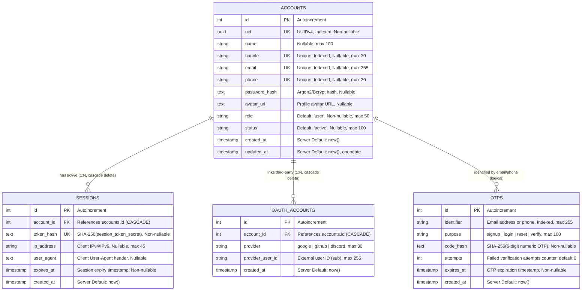
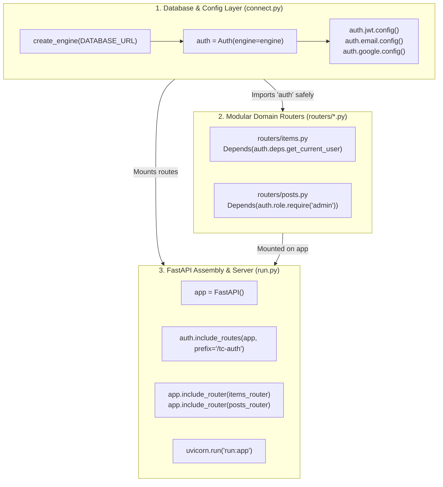
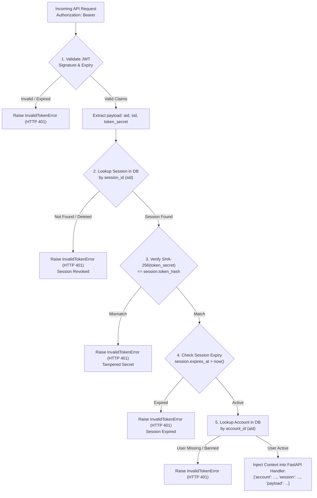
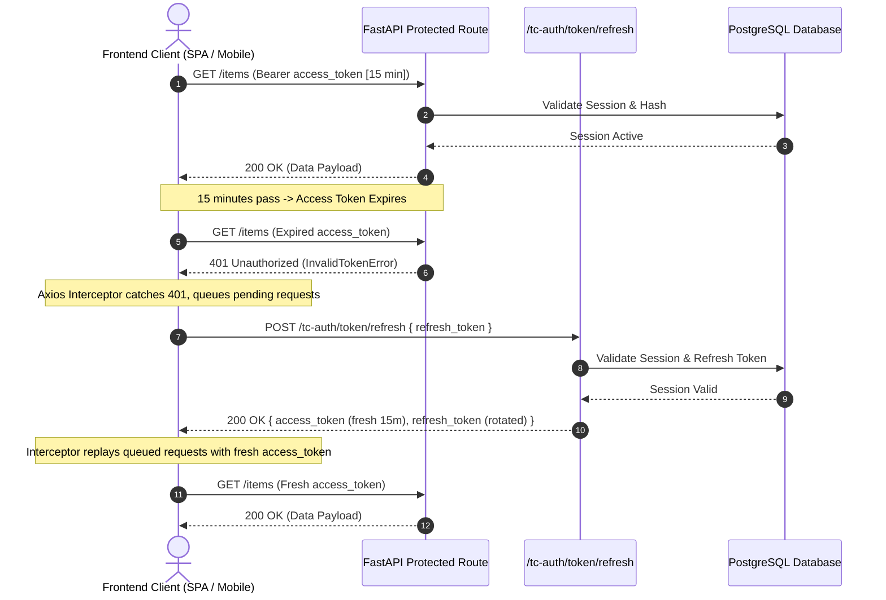
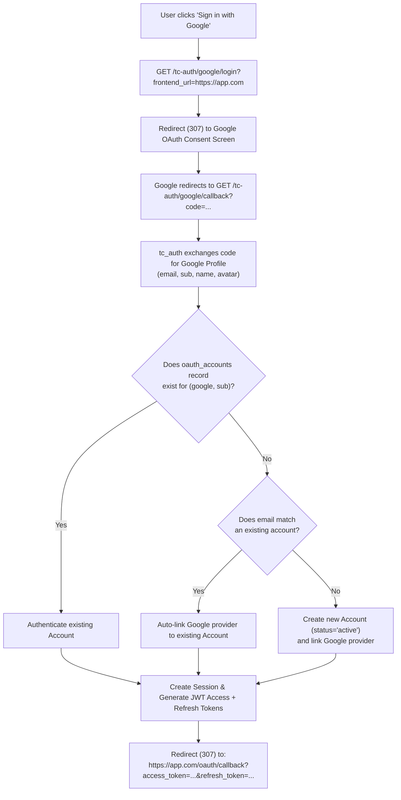
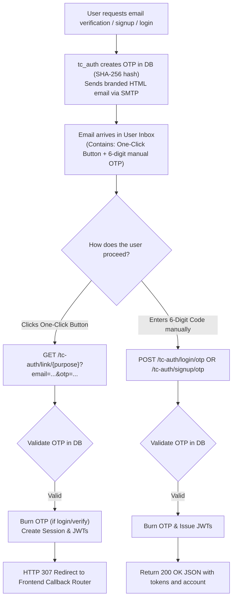

# Architecture, Database Models & Entity Relations (ERD)

This document provides a comprehensive visual and architectural breakdown of **CodeSena Auth (`tc_auth`)**, including Entity-Relationship (ER) diagrams, relational constraints, system architecture flowcharts, and security lifecycles.

---

## 1. Entity-Relationship Diagram (ERD)



---

## 2. Table Schemas & Relational Constraints

### 2.1 `accounts` Table
The primary identity record. Supports password authentication, social logins, or passwordless OTP logins.

```sql
CREATE TABLE accounts (
    id SERIAL PRIMARY KEY,
    uid UUID UNIQUE NOT NULL DEFAULT gen_random_uuid(),
    name VARCHAR(100),
    handle VARCHAR(30) UNIQUE,
    email VARCHAR(255) UNIQUE,
    phone VARCHAR(20) UNIQUE,
    password_hash TEXT,
    avatar_url TEXT,
    role VARCHAR(50) NOT NULL DEFAULT 'user',
    status VARCHAR(100) DEFAULT 'active',
    created_at TIMESTAMP NOT NULL DEFAULT NOW(),
    updated_at TIMESTAMP NOT NULL DEFAULT NOW()
);

CREATE INDEX ix_accounts_uid ON accounts(uid);
CREATE INDEX ix_accounts_handle ON accounts(handle);
CREATE INDEX ix_accounts_email ON accounts(email);
CREATE INDEX ix_accounts_phone ON accounts(phone);
```

### 2.2 `sessions` Table
Stores active user sessions with cryptographically hashed secrets. Raw session secret tokens are never stored in plaintext.

```sql
CREATE TABLE sessions (
    id SERIAL PRIMARY KEY,
    account_id INTEGER NOT NULL REFERENCES accounts(id) ON DELETE CASCADE,
    token_hash TEXT UNIQUE NOT NULL,
    ip_address VARCHAR(45),
    user_agent TEXT,
    expires_at TIMESTAMP NOT NULL,
    created_at TIMESTAMP NOT NULL DEFAULT NOW()
);

CREATE INDEX ix_sessions_account_id ON sessions(account_id);
```

### 2.3 `oauth_accounts` Table
Binds external OAuth 2.0 / OpenID Connect identity providers (Google, GitHub, Discord) to an account.

```sql
CREATE TABLE oauth_accounts (
    id SERIAL PRIMARY KEY,
    account_id INTEGER NOT NULL REFERENCES accounts(id) ON DELETE CASCADE,
    provider VARCHAR(30) NOT NULL,
    provider_user_id VARCHAR(255) NOT NULL,
    created_at TIMESTAMP NOT NULL DEFAULT NOW(),
    CONSTRAINT uq_oauth_provider_user UNIQUE (provider, provider_user_id),
    CONSTRAINT uq_account_provider UNIQUE (account_id, provider)
);

CREATE INDEX ix_oauth_accounts_account_id ON oauth_accounts(account_id);
CREATE INDEX ix_oauth_accounts_provider ON oauth_accounts(provider);
CREATE INDEX ix_oauth_accounts_provider_user_id ON oauth_accounts(provider_user_id);
```

### 2.4 `otps` Table
Stores short-lived 6-digit numeric verification codes for signup, login, password reset, and email verification.

```sql
CREATE TABLE otps (
    id SERIAL PRIMARY KEY,
    identifier VARCHAR(255) NOT NULL,
    purpose VARCHAR(100) NOT NULL,
    code_hash TEXT NOT NULL,
    attempts INTEGER NOT NULL DEFAULT 0,
    expires_at TIMESTAMP NOT NULL,
    created_at TIMESTAMP NOT NULL DEFAULT NOW()
);

CREATE INDEX ix_otps_identifier ON otps(identifier);
CREATE INDEX idx_otp_identifier_purpose ON otps(identifier, purpose);
```

---

## 3. System Architecture & Lifecycle Flowcharts

### 3.1 Decoupled Initialization (`connect.py` vs `run.py`)

Eliminates circular import issues across modular FastAPI applications:



---

### 3.2 Dual-Layer Request Authentication & Session Validation

Every protected API request validates both the signed JWT claims and the server-side hashed session:



---

### 3.3 Dual-Token Lifecycle (Short-Lived Access + Rotating Refresh Token)



---

### 3.4 OAuth 2.0 / OIDC Multi-Provider Linking Flow



---

### 3.5 Dual-Pathway Email Verification (Magic Link + Numeric OTP)



---

### 3.6 Safe OAuth Unlinking with Account Lockout Prevention

```mermaid
flowchart TD
    UnlinkReq["DELETE /tc-auth/account/oauth/{provider}\n(Authenticated Request)"] --> FetchAccount["Fetch Account & linked OAuth providers"]
    
    FetchAccount --> CheckPassword{"Does account have a\npassword set (password_hash != null)?"}
    
    CheckPassword -->|Yes| AllowUnlink["Delete OAuthAccount record from DB\nReturn 200 OK"]
    CheckPassword -->|No| CheckOtherProviders{"Are there other linked\nOAuth providers?"}
    
    CheckOtherProviders -->|Yes| AllowUnlink
    CheckOtherProviders -->|No (Only 1 Provider & No Password)| BlockUnlink["Raise AuthError (HTTP 400)\n'Cannot unlink provider: Account has no password\nand this is the only linked OAuth provider'"]
```
