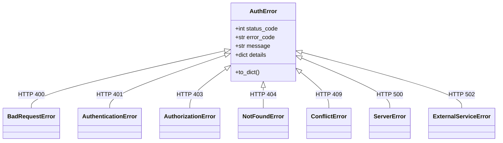

# TC Auth — Changelog 2: Cookie Mode Architecture & Localhost/Production Configuration

This document records the complete architecture and implementation details for the **Cookie Mode Zero-Leakage Subsystem**, **Response Metadata**, **Cross-Domain/Localhost Cookie Configuration**, **OAuth & Magic Link Cookie Integration**, and standard **Logout & Cookie Clearing**.

---

# Table of Contents
1. [Cookie Mode Zero-Leakage & Response Metadata](#1-cookie-mode-zero-leakage--response-metadata)
2. [Cross-Domain & Localhost Cookie Configuration Guide](#2-cross-domain--localhost-cookie-configuration-guide)
3. [OAuth Providers & Magic Links in Cookie Mode](#3-oauth-providers--magic-links-in-cookie-mode)
4. [Standard Logout & Cookie Invalidation](#4-standard-logout--cookie-invalidation)
5. [Comprehensive Error Hierarchy & Error Handling](#5-comprehensive-error-hierarchy--error-handling)
6. [Complete Frontend Integration Recipes](#6-complete-frontend-integration-recipes)
7. [Verification Results & Test Suite Summary](#7-verification-results--test-suite-summary)

---

## 1. Cookie Mode Zero-Leakage & Response Metadata

### 1.1 The Problem: Token Leakage in JSON Response Body

When Cookie mode is enabled, storing tokens in `HttpOnly` cookies is intended to protect credentials against client-side Cross-Site Scripting (XSS). If authentication routes were to still return `access_token` and `refresh_token` strings in the JSON response body, that XSS protection would be compromised because malicious client scripts could intercept the tokens from the JSON response.

### 1.2 The Solution: Zero-Leakage Response with Cookie Metadata

When `cookie_mode = True` and a FastAPI `Response` object is present:
1. Tokens are placed inside `HttpOnly` cookies via `Set-Cookie` headers.
2. Tokens are **completely omitted** from the JSON response body.
3. The response body includes `token_type: "Cookie"` and a safe `cookie` metadata block so the frontend has confirmation that cookies have been issued without exposing secret values.

#### Login / Signup Response Body (`cookie_mode = True`):
```json
{
  "token_type": "Cookie",
  "account": {
    "id": 1,
    "uid": "5396fa4b-37a3-489d-8c66-e3a53d14ffc3",
    "name": "Jane Doe",
    "handle": "jane",
    "email": "jane@example.com",
    "phone": null,
    "avatar_url": null,
    "role": "user",
    "status": "active",
    "created_at": "2026-09-05T16:31:52.602447",
    "updated_at": "2026-09-10T20:11:40.365154"
  },
  "cookie": {
    "cookie_mode": true,
    "access_cookie_name": "access_token",
    "refresh_cookie_name": "refresh_token",
    "path": "/",
    "domain": null,
    "secure": true,
    "samesite": "none"
  }
}
```

#### Token Refresh Response Body (`POST /tc-auth/token/refresh` with `cookie_mode = True`):
```json
{
  "success": true,
  "message": "Tokens refreshed successfully",
  "token_type": "Cookie",
  "cookie": {
    "cookie_mode": true,
    "access_cookie_name": "access_token",
    "refresh_cookie_name": "refresh_token",
    "path": "/",
    "domain": null,
    "secure": true,
    "samesite": "none"
  }
}
```

### 1.3 Safe Cookie Info in `CookieService` (`tc_auth/cookie.py`)

`CookieService.get_cookie_info()` returns non-sensitive metadata for frontend consumption:
```python
def get_cookie_info(self) -> dict:
    """
    Returns non-sensitive metadata about active cookie configuration.
    Safe to return to client in response bodies.
    """
    cfg = self.load()
    info = {
        "cookie_mode": cfg.get("cookie_mode", False),
        "access_cookie_name": cfg.get("access_cookie_name", "access_token"),
        "path": cfg.get("path", "/"),
        "domain": cfg.get("domain"),
        "secure": cfg.get("secure", False),
        "samesite": cfg.get("samesite", "lax"),
    }
    if cfg.get("refresh_cookie_name"):
        info["refresh_cookie_name"] = cfg.get("refresh_cookie_name")
    return info
```

---

## 2. Cross-Domain & Localhost Cookie Configuration Guide

### 2.1 Understanding Cookie Boundaries

When working with split frontends and backends (e.g. Cloudflare tunnels, subdomains, or localhost dev servers), browser cookie rules dictate what is permitted:

| Environment Setup | Frontend Origin | Backend Origin | `COOKIE_DOMAIN` Setting | `COOKIE_SAMESITE` | `COOKIE_SECURE` |
| :--- | :--- | :--- | :--- | :--- | :--- |
| **Local Frontend Dev** | `http://localhost:3000` | `https://api.codesena.me` | *(leave empty)* | `none` | `true` |
| **Production Subdomains** | `https://auth.codesena.me` | `https://api.codesena.me` | `.codesena.me` | `lax` | `true` |
| **Same Domain** | `https://codesena.me` | `https://codesena.me/api` | *(leave empty)* | `lax` | `true` |

### 2.2 Why `COOKIE_DOMAIN=.codesena.me` Fails on `localhost:3000`

1. **Host Mismatch**: A browser on `http://localhost:3000` considers `api.codesena.me` as a third-party cross-site origin.
2. **Domain Rejection**: If `https://api.codesena.me` sends `Set-Cookie: access_token=...; Domain=.codesena.me`, the browser will store the cookie for `codesena.me`, but it will **never send it** from `localhost:3000` because `localhost` is not a subdomain of `codesena.me`.
3. **SameSite Block**: By default, `SameSite=Lax` cookies are not sent on cross-site asynchronous requests (`fetch` / `XHR`) initiated from `localhost`.

### 2.3 Recommended `.env` Settings for Local Development (`localhost:3000` ↔ `api.codesena.me`)

```env
# Cookie Authentication Subsystem
COOKIE_MODE=true
COOKIE_ACCESS_NAME=access_token
COOKIE_REFRESH_NAME=refresh_token
COOKIE_PATH=/
COOKIE_DOMAIN=
COOKIE_SECURE=true
COOKIE_HTTPONLY=true
COOKIE_SAMESITE=none
COOKIE_MAX_AGE=
```

> [!IMPORTANT]
> When `COOKIE_DOMAIN` is empty, the cookie becomes a **Host-Only Cookie** tied specifically to `api.codesena.me`.
> When combined with `SameSite=None; Secure`, the browser allows `localhost:3000` to send and receive the credentials over HTTPS via Cloudflare Tunnel.

### 2.4 Where to Find Cookies in Browser DevTools

When testing `http://localhost:3000` with `https://api.codesena.me`:
* **Incorrect Location**: DevTools -> Application/Storage -> Cookies -> `http://localhost:3000` (it will be empty!).
* **Correct Location**: DevTools -> Application/Storage -> Cookies -> **`https://api.codesena.me`**.
* In the Network tab, inspect requests to `https://api.codesena.me/tc-auth/...`:
  * Look for the `Set-Cookie` header on responses.
  * Look for the `Cookie` header on subsequent requests.

### 2.5 CORS Requirements for Cookie Authentication

FastAPI CORS middleware must explicitly allow the requesting origin and allow credentials:
```python
app.add_middleware(
    CORSMiddleware,
    allow_origins=[
        "https://auth.codesena.me",
        "https://api.codesena.me",
        "http://localhost:3000",
        "http://localhost:5173",
    ],
    allow_origin_regex=r"^https://.*\.codesena\.me$",
    allow_credentials=True, # MANDATORY: allows browser to send & receive cookies
    allow_methods=["*"],
    allow_headers=["*"],
)
```

> [!WARNING]
> Setting `allow_origins=["*"]` with `allow_credentials=True` is forbidden by modern browser security standards and will result in a browser CORS error. Always specify explicit origins.

---

## 3. OAuth Providers & Magic Links in Cookie Mode

### 3.1 OAuth Providers (Google, GitHub, Discord)

All OAuth provider callbacks (`/tc-auth/{provider}/callback`) inspect `auth.cookie.is_cookie_mode()`:
1. When `cookie_mode = True`, the callback attaches `Set-Cookie` headers directly to the `307 Temporary Redirect` response pointing to `frontend_url`.
2. For backwards compatibility, the redirect URL query parameters (`?access_token=...&refresh_token=...`) are also retained so legacy client callback pages do not break.
3. Both single-token and dual-token cookies are issued with matching `HttpOnly`, `Secure`, `SameSite`, and `Domain` parameters.

### 3.2 Magic Links (GET & POST)

1. **Magic Link GET (`/tc-auth/link/{purpose}`)**:
   - The user clicks the link in their email (`https://api.codesena.me/tc-auth/link/login?email=...&otp=...&frontend_url=...`).
   - The backend validates the one-time cryptographic code, issues a `307 Temporary Redirect` to `frontend_url`, and attaches the authentication `Set-Cookie` headers on the redirect response.
2. **Magic Link POST (`/tc-auth/verify/magic-link`)**:
   - The frontend calls the verification endpoint directly via JSON.
   - The backend attaches `Set-Cookie` headers and returns:
     ```json
     {
       "token_type": "Cookie",
       "account": { ... },
       "cookie": { ... }
     }
     ```

---

## 4. Standard Logout & Cookie Invalidation

The standard logout endpoints remain `POST /tc-auth/logout` and `POST /tc-auth/logout-all`.

### 4.1 Endpoints

#### 1. Single Session Logout: `POST /tc-auth/logout`
- **Method**: `POST`
- **Authentication**: Required (`Authorization: Bearer <access_token>` header OR `access_token` cookie)
- **Database Effect**: Deletes the caller's active `Session` record by session ID.
- **Cookie Mode Behavior**: Emits `Set-Cookie` response headers with `Max-Age=0` and expired date (`Expires=Thu, 01 Jan 1970 00:00:00 GMT`), clearing both `access_token` and `refresh_token` cookies in the browser.
- **Success Response** (`200 OK`):
  ```json
  {
    "success": true,
    "message": "Session destroyed successfully"
  }
  ```

#### 2. Global Logout: `POST /tc-auth/logout-all`
- **Method**: `POST`
- **Authentication**: Required
- **Database Effect**: Deletes all `Session` records for the user account.
- **Cookie Mode Behavior**: Clears cookies on the caller's response via `Max-Age=0`.
- **Success Response** (`200 OK`):
  ```json
  {
    "success": true,
    "message": "All sessions destroyed for account",
    "count": 2
  }
  ```

### 4.2 Implementation in `tc_auth/api/account_route.py`

```python
@self.router.post("/logout")
def logout(response: Response, user=current):
    result = self.session_service.destroy_session(user["session"]["id"])
    if self.cookie_service and self.cookie_service.is_cookie_mode():
        self.cookie_service.clear_auth_cookies(response)
    return result

@self.router.post("/logout-all")
def logout_all(response: Response, user=current):
    result = self.session_service.destroy_all(user["account"]["id"])
    if self.cookie_service and self.cookie_service.is_cookie_mode():
        self.cookie_service.clear_auth_cookies(response)
    return result
```

---

## 5. Comprehensive Error Hierarchy & Error Handling

### 5.1 Architecture Overview

All exceptions across `tc_auth` inherit from a unified base class, `AuthError`, organized into semantic functional categories matching standard HTTP status codes. This ensures clear separation of concerns, machine-readable `error_code` tags, and 100% backwards compatibility with existing exception handlers.



### 5.2 Category Breakdown & Subclasses

| Category Base Class | HTTP Status | Error Code | Specialized Subclasses |
| :--- | :--- | :--- | :--- |
| **`BadRequestError`** | `400` | `bad_request` | `InvalidFieldError`, `MissingRequiredFieldError`, `InvalidIdentifierError`, `WeakPasswordError`, `OTPValidationError`, `InvalidEmailPurposeError`, `UnsupportedOAuthProviderError`, `OAuthUnlinkLockoutError` |
| **`AuthenticationError`** | `401` | `authentication_error` | `InvalidCredentialsError`, `InvalidTokenError`, `TokenMissingError`, `TokenExpiredError`, `TokenMalformedError`, `TokenSignatureError`, `TokenRevokedError`, `SessionExpiredError`, `OTPInvalidError`, `OTPExpiredError`, `OAuthAuthenticationError` |
| **`AuthorizationError`** | `403` | `authorization_error` | `PermissionDeniedError`, `RoleMismatchError`, `RoleBlockedError`, `AccountStatusError`, `AccountSuspendedError`, `AccountInactiveError` |
| **`NotFoundError`** | `404` | `not_found` | `UserNotFoundError`, `SessionNotFoundError`, `OTPNotFoundError`, `OAuthLinkNotFoundError` |
| **`ConflictError`** | `409` | `conflict` | `AlreadyExistsError`, `EmailAlreadyExistsError`, `HandleAlreadyExistsError`, `PhoneAlreadyExistsError`, `OAuthAlreadyLinkedError` |
| **`ServerError`** | `500` | `server_error` | `DatabaseError`, `DatabaseIntegrityError`, `DatabaseConnectionError`, `ConfigurationError`, `InvalidConfigError`, `OAuthNotConfiguredError`, `EmailNotConfiguredError`, `CookieNotConfiguredError`, `ServiceUnavailableError` (503) |
| **`ExternalServiceError`** | `502` | `external_service_error` | `EmailError`, `EmailSendError`, `OAuthError`, `OAuthCallbackError`, `OAuthProviderError` |

### 5.3 Exception Response Structure

FastAPI handles all `AuthError` instances through `auth_exception_handler` (`tc_auth/exceptions/handler.py`), returning clean, consistent JSON:

```json
{
  "success": false,
  "error_code": "invalid_credentials",
  "message": "Invalid credentials"
}
```

If optional structured details are attached to the exception, they are automatically included:
```json
{
  "success": false,
  "error_code": "invalid_field",
  "message": "Invalid field: email",
  "details": {
    "field": "email"
  }
}
```

---

## 6. Complete Frontend Integration Recipes

### 6.1 Universal JavaScript Client (`fetch`)

```javascript
const API_BASE = "https://api.codesena.me/tc-auth";

/**
 * Reusable HTTP client supporting both localStorage & Cookie modes
 */
async function request(endpoint, options = {}) {
  const token = localStorage.getItem("access_token");
  const headers = {
    "Content-Type": "application/json",
    ...(options.headers || {}),
  };

  // Attach token if in localStorage mode
  if (token) {
    headers["Authorization"] = `Bearer ${token}`;
  }

  const res = await fetch(`${API_BASE}${endpoint}`, {
    ...options,
    headers,
    credentials: "include", // CRITICAL: Sends and receives cookies cross-site
  });

  if (res.status === 401) {
    // Session expired or logged out
    localStorage.removeItem("access_token");
    localStorage.removeItem("refresh_token");
    window.location.href = "/login";
  }

  return res;
}

/**
 * 1. Login with Password
 */
export async function login(identifier, password) {
  const res = await request("/login/password", {
    method: "POST",
    body: JSON.stringify({ identifier, password }),
  });
  const data = await res.json();
  
  if (res.ok) {
    // If backend is in localStorage mode, tokens exist in data:
    if (data.access_token) localStorage.setItem("access_token", data.access_token);
    if (data.refresh_token) localStorage.setItem("refresh_token", data.refresh_token);
  }
  return { ok: res.ok, data };
}

/**
 * 2. Fetch Authenticated Profile
 */
export async function getProfile() {
  const res = await request("/me", { method: "GET" });
  return await res.json();
}

/**
 * 3. Rotate / Refresh Tokens
 */
export async function refreshTokens() {
  const refreshToken = localStorage.getItem("refresh_token");
  // In Cookie mode, refresh_token cookie is sent automatically.
  // In localStorage mode, pass refresh_token in the body.
  const res = await request("/token/refresh", {
    method: "POST",
    body: JSON.stringify(refreshToken ? { refresh_token: refreshToken } : {}),
  });
  const data = await res.json();
  if (res.ok && data.access_token) {
    localStorage.setItem("access_token", data.access_token);
  }
  return data;
}

/**
 * 4. Logout Current Session
 */
export async function logout() {
  try {
    const res = await request("/logout", { method: "POST" });
    return await res.json();
  } finally {
    localStorage.removeItem("access_token");
    localStorage.removeItem("refresh_token");
    window.location.href = "/login";
  }
}

/**
 * 5. Logout All Sessions (Across All Devices)
 */
export async function logoutAll() {
  try {
    const res = await request("/logout-all", { method: "POST" });
    return await res.json();
  } finally {
    localStorage.removeItem("access_token");
    localStorage.removeItem("refresh_token");
    window.location.href = "/login";
  }
}
```

### 6.2 `axios` Integration

```javascript
import axios from "axios";

const api = axios.create({
  baseURL: "https://api.codesena.me/tc-auth",
  withCredentials: true, // MANDATORY: Enables cross-origin cookie storage and transmission
});

// Interceptor to attach Bearer token if present in localStorage
api.interceptors.request.use((config) => {
  const token = localStorage.getItem("access_token");
  if (token) {
    config.headers.Authorization = `Bearer ${token}`;
  }
  return config;
});

// Interceptor to handle 401 session expiration
api.interceptors.response.use(
  (response) => response,
  (error) => {
    if (error.response && error.response.status === 401) {
      localStorage.removeItem("access_token");
      localStorage.removeItem("refresh_token");
      window.location.href = "/login";
    }
    return Promise.reject(error);
  }
);

export const authApi = {
  login: (data) => api.post("/login/password", data),
  getProfile: () => api.get("/me"),
  refreshToken: (data = {}) => api.post("/token/refresh", data),
  logout: () => api.post("/logout"),
  logoutAll: () => api.post("/logout-all"),
};
```

---

## 7. Verification Results & Test Suite Summary

The entire suite was executed against the active PostgreSQL database and live server endpoints:

| Test Suite / Feature | Verification Method | Tests Passed | Status |
| :--- | :--- | :--- | :--- |
| **Error Hierarchy Test Suite** | `scratch/test_error_hierarchy.py` | 12 / 12 | **PASSED** |
| **Unit Test Suite** | `scratch/test_cookie_auth.py` | 9 / 9 | **PASSED** |
| **Live Cookie Mode Suite** | `scratch/verify_live_cookie_mode.py` | 9 / 9 | **PASSED** |
| **OAuth & Magic Links Suite** | `scratch/verify_oauth_magic_cookies.py` | 6 / 6 | **PASSED** |
| **Logout Endpoint** | `POST /tc-auth/logout` | Live HTTP 200 | **PASSED** |
| **Global Logout Endpoint** | `POST /tc-auth/logout-all` | Live HTTP 200 | **PASSED** |
| **Cookie Invalidation (`Max-Age=0`)** | `clear_auth_cookies()` with `SameSite`, `Secure` | Response Header Verified | **PASSED** |

